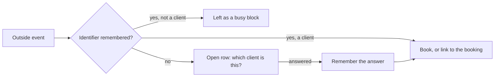

# Outside sessions: remembered answers and bookings

**Status:** Design record, 2026-10-01. Describes what is built.
**Scope:** how Pablo turns events on calendars it follows (Google
Calendar, and EHR calendar feeds such as SimplePractice and Sessions
Health) into booked sessions: which client an event is, who that answer
belongs to, who can see it, and how one event never becomes two bookings.

This area grew one careful rule at a time, and each rule is simple on its
own. This document puts them side by side, so the next change starts from
the whole picture.

## The flow in one paragraph

A clinician follows a calendar. Each read of it brings **outside events**.
An event that looks like a session but names no client Pablo is sure of
becomes an **open row**: a question, "which client is this?". The
clinician **answers** it (a client, or "not a client"). The answer is
**remembered**, so the next event with the same identifier is settled
without asking. Settling an event as a client **books** it: an appointment
on the clinician's diary, which then follows the event (a move or a
cancellation in the calendar reaches the appointment).

## Vocabulary

| Term | Where it lives | What it is |
|---|---|---|
| Outside event | the provider | An event on a followed calendar or feed. |
| Open row | `external_calendar_events` | One clinician's question about one event, and later its answer. Per clinician: two followers of one calendar each have a row. |
| Identifier | in memory only | What an event names its client by. A Google series (`series:`), the shape of a one-off event (`shape:`), or a feed's own code or name (`feed:`), such as `SH00001` or `Jane Smith`. |
| Remembered answer | `patient_source_mappings` | Identifier → client (or "not a client"), under a **scope**. |
| Booking | `appointments` | The session on a clinician's diary that follows the event (`outside_source`, `outside_calendar_id`, `outside_event_id`). |

## Whose answer is it: scopes

Every remembered answer has a scope, and the scope decides who reuses it.

| Scope | For | Shared with |
|---|---|---|
| `calendar:<calendar id>` | A Google calendar's series and one-off shapes | Everyone who follows that calendar |
| `clinician:<user id>` | A feed's client codes and names | Nobody: that clinician only |
| none (NULL) | Rows written before scopes existed | Their owner, until adopted |

**Why a calendar's answers are shared.** Two clinicians following one
team calendar see the same events. When the first one answers "the Monday
9:00 series is Jane", the second should not be asked again.

**Why a feed's answers are not.** A feed's identifiers are the
clinician's own, not the practice's:

- A Sessions Health client code is numbered from the importing clinician's
  own export (`SH00001` is row 1 of *their* client list). Two clinicians'
  `SH00001` are usually two different people.
- Two clinicians can each have a client named Jane Smith.

Sharing them made one clinician's answer overwrite another's. The first
clinician's sessions then stopped booking, or booked to the wrong client.

**Adoption.** Rows from before scopes hold the identifier in plain text
and no scope. On the owner's first read of that source they are rewritten
once: digested, given the owner's scope (a feed) or the main calendar's
(a calendar series), and the plain row is removed. Where an adopted answer
and a newer scoped answer disagree, the newer stands. The migration cannot
do this, because the digest key is an application secret.

## How identifiers are stored

An identifier is never stored as typed. It is stored as
`<kind>:<HMAC-SHA256 of the normalised identifier>`, keyed by a subkey of
the calendar encryption key (`patients/identifiers.py`). The kind stays
readable because it decides whether an answer may book without asking.
Matching needs only equality, so a copy of the table says nothing to
anyone without the key.

The consequence: **rotating the calendar encryption key makes every
remembered answer unmatchable** (and every stored calendar token
undecryptable). Rotating safely needs a keyring (a current key plus
previous ones) and is not built yet.

## Who can see what

Row-level security does the enforcing; the app's checks sit on top.

**`patient_source_mappings`** (policy `rls_practice_answers`, defined once
in `db/practice_answers.py`):

| Row | Readable and writable by |
|---|---|
| `scope` starts `calendar:` | any clinician with a session armed |
| `scope = clinician:<id>` | that clinician only |
| no scope | its owner (`user_id`) only |
| nothing armed | nobody |

**`appointments`** are their owner's. A colleague who shares the client
still cannot read another clinician's appointment.

**The one exception: the outside-event lookup.** To keep one event to one
booking, a clinician must be able to ask "is this event already booked in
the practice, and as which appointment?" without reading the appointment.
`practice_outside_appointment(source, calendar_id, event_id)` answers
exactly that: an appointment id, nothing else. It is a `SECURITY DEFINER`
function owned by the directory role (`db/practice_directory.py`), with its
`search_path` pinned. That role can read six appointment columns: `id`,
the three `outside_*` columns, `status` and `created_at`. It cannot read
`patient_id`, `title` or `user_id`, and
`test_practice_client_directory.py` holds it to that.

## One outside event, one live booking

**The rule.** Two unique partial indexes over live (not cancelled)
appointments:

- `uq_appointments_outside_event_per_calendar`: one per
  `(outside_source, outside_calendar_id, outside_event_id)`.
- `uq_appointments_outside_event_per_clinician`: one per
  `(outside_source, user_id, outside_event_id)`, for feeds and for
  sessions booked before calendars were recorded.

**Booking** (`OutsideSessions._book`):

1. If the event is already booked (the lookup above), link the row to that
   appointment instead of making another.
2. If anything else is already on the diary at that time, don't book; the
   row is still answered.
3. Otherwise create the appointment. If another request got there first,
   the index refuses this one, and the row links as in step 1.

**Writes that can break the rule.** Creating a booking, or recording a
booking's calendar (when an event moves to another followed calendar, or a
session from before calendars were recorded is claimed onto the main
calendar), can collide with a colleague's booking. Each runs in a
savepoint. In Postgres an error aborts the whole transaction, so without
the savepoint one collision would throw away everything else the read did,
and the next read would hit it again. A collision becomes
`OutsideEventAlreadyBookedError`; recording a calendar catches it and
leaves that session as it was.

**The main calendar's id.** Answers and bookings are keyed by the main
calendar's real id, asked of the calendar list. If Google names no id, the
read still happens (the API answers to `primary`), but nothing is recorded
under `primary`. It is the same word for every account, so recording it
would make every such clinician share one calendar key. The rows stay
unrecorded until a read learns the real id, and are claimed onto it then.

## Known limitations

These are decided, not overlooked.

**Conflicting answers on a shared calendar.** Dr. A answers the shared
Monday 9:00 event as Jane, and it is booked for Jane on A's diary. Dr. B
then answers the same event as Lulu. The event is already booked, so B's
row is linked to A's booking for Jane, and B's row now says Lulu while
pointing at Jane's session.

The obvious check, "read the booking and compare its client", is not
available: B cannot read A's appointment, by design. Options considered:

| Option | Cost |
|---|---|
| Refuse B's answer when the calendar's shared answer names another client, which B can read | A new error path and a message for the clinician |
| Let the lookup compare clients itself | The directory role would need `patient_id`, reversing the boundary above |
| Leave it, and write it down | The mismatch can happen |

Chosen for now: leave it. No deployment uses shared calendars yet. The
first option is the way forward when they do.

**Key rotation.** See *How identifiers are stored*.

**Existing duplicate bookings.** The migration that added the indexes
keeps the oldest booking of each event and stops the others following it.
They stay on the diary but no longer move with the event. This only
matters for data written before the indexes, and there is none yet.

## Testing it

- **In-memory repositories are not the database.** They copy on read and
  write, so a change that is never saved fails a test instead of passing by
  sharing objects. But the in-memory appointment repository lets a
  colleague who shares a client read another clinician's appointment, and
  Postgres does not. A fix that depends on who can read what has to be
  proven by an integration test: the first attempt at the conflict check
  above passed every unit test and failed against Postgres.
- **Integration tests run as the app's own role** (`NOSUPERUSER
  NOBYPASSRLS`), so the policies above are what they exercise. Assertions
  about the whole table read past the policy, and that read waits on any
  transaction still open on the table, so tests commit their sessions
  first.
- **End to end**, the local stack's Google stand-in serves OAuth and
  Calendar v3 from one origin. Every Calendar client must be built through
  `GoogleCalendarService._calendar`, the one place that honours the
  stand-in's base URL. A test holds that, because a client built any other
  way calls Google itself in the middle of a stand-in read.

## Code map

| Concern | Where |
|---|---|
| Open rows, answering, booking, linking | `backend/app/services/outside_sessions.py` |
| Matching an identifier to a client; adoption | `backend/app/patients/matching.py` |
| Scopes and digests | `backend/app/patients/identifiers.py`, `backend/app/calendar_providers/source_identity.py` (`answer_scope`) |
| Feeds and their identifiers | `backend/app/services/ical_sync_service.py` |
| Google reads, the main calendar's id | `backend/app/services/google_calendar_service.py` |
| Answers' row policy | `backend/app/db/practice_answers.py` |
| The outside-event lookup and its role | `backend/app/db/practice_directory.py` |
| Indexes, columns, the duplicate pass | `backend/alembic/versions/e5b7c2a9d4f1_practice_owned_answers.py` |
| The policies against Postgres | `backend/tests_integration/database/test_practice_owned_answers_db.py`, `test_practice_client_directory.py` |
